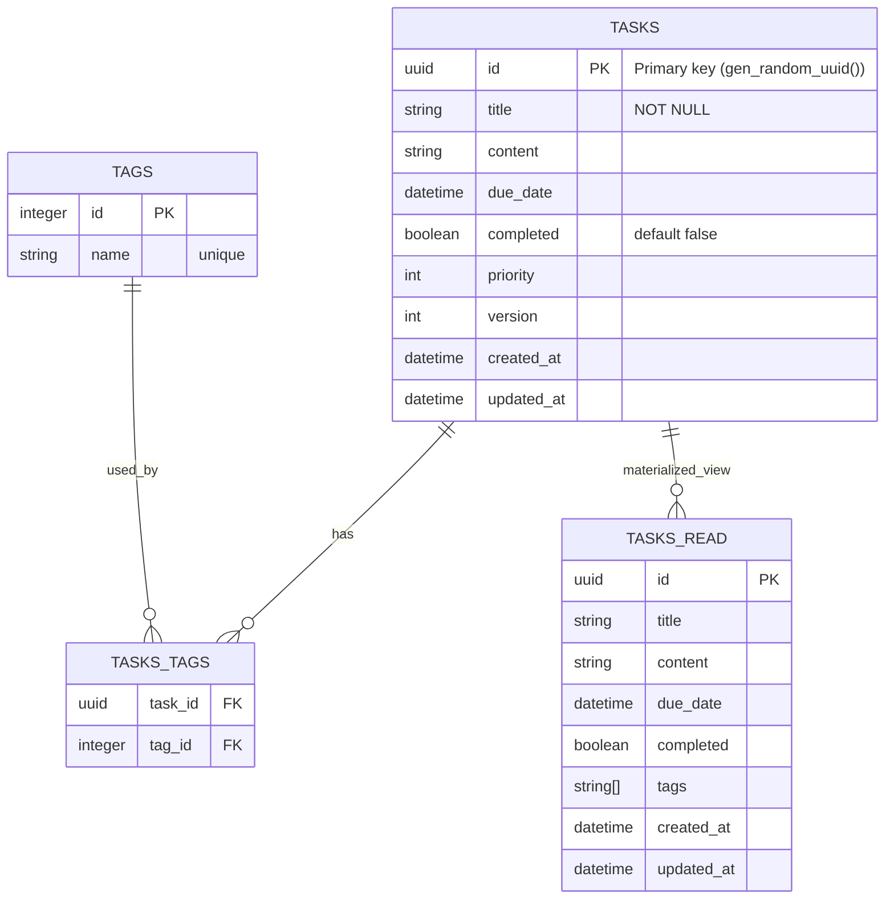

# ER図

```mermaid
erDiagram
    TASKS {
        uuid id PK "Primary key (gen_random_uuid())"
        string title "NOT NULL"
        string content
        datetime due_date
        boolean completed "default false"
        int priority
        int version
        datetime created_at
        datetime updated_at
    }
    TAGS {
        integer id PK
        string name "unique"
    }
    TASKS_TAGS {
        uuid task_id FK
        integer tag_id FK
    }

    TASKS ||--o{ TASKS_TAGS : "has"
    TAGS ||--o{ TASKS_TAGS : "used_by"

    %% Optional: read model (materialized view)
    TASKS_READ {
        uuid id PK
        string title
        string content
        datetime due_date
        boolean completed
        string[] tags
        datetime created_at
        datetime updated_at
    }
    TASKS ||--o{ TASKS_READ : "materialized_view"
```

補足:
- 全文検索: `to_tsvector(title || ' ' || content)` に対する GIN インデックスを推奨
- タグは正規化 (tags + tasks_tags) を採用
- 楽観ロック: `version` カラムでのバージョン管理
- マテリアライズドビュー: `tasks_read` を読み取り用に用意し、API の高速化に利用
